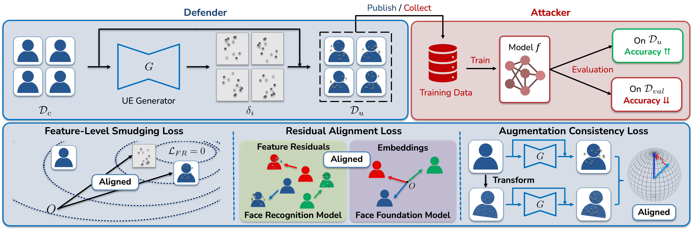
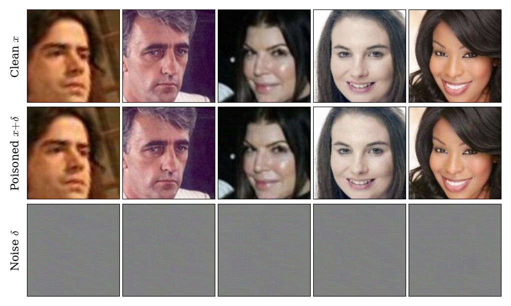
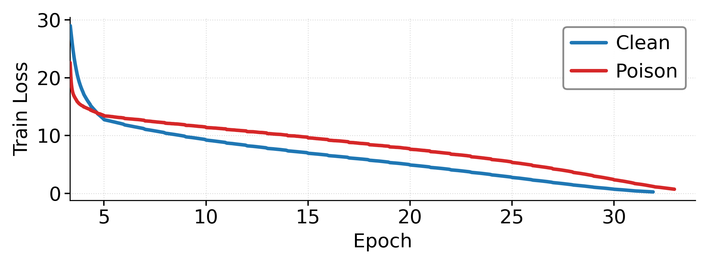
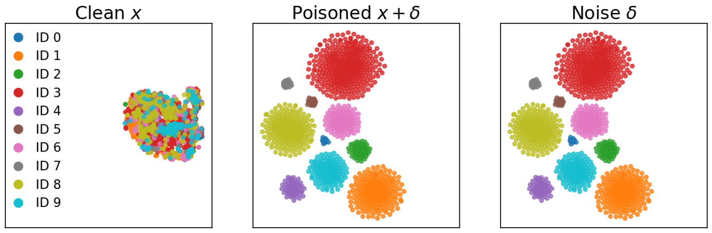
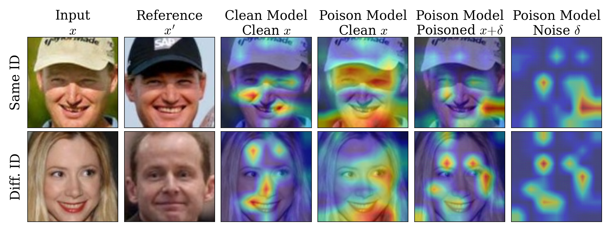

<h1 align="center">FacePoison</h1>

<p align="center">
  <em>Unlearnable examples for open-set face recognition.</em>
</p>

<p align="center">
  
  
  
  
  
</p>

> [!IMPORTANT]
> **This work is currently under peer review at *IEEE Signal Processing Letters*.**
> The code is released for reproducibility; details may change in the camera-ready
> version.

Official source code for

> **Towards Generating Unlearnable Examples for Open-Set Face Recognition**
> Seunghun Paik, Chanwoo Hwang, Jae Hong Seo (the first two authors contributed equally)
> *Department of Mathematics & Research Institute for Natural Sciences, Hanyang University*

<p align="center">
  
</p>

We present the **first unlearnable-example (UE) generator tailored for open-set Face
Recognition (FR)**.  A *defender* uses the generator `G` to add an imperceptible perturbation
`δ_i = G(x_i)` to each clean face image; an *attacker* who later trains an FR model on the
protected dataset `D_u = { x_i + δ_i }` ends up with a model whose accuracy on a held-out
evaluation set collapses to that of a randomly-initialized network — while the perturbations
remain imperceptible (average **PSNR 32.48 dB / SSIM 0.873** on LFW).

> [!NOTE]
> This repository builds on top of two upstream projects:
> [InsightFace](https://github.com/deepinsight/insightface) (training scripts, FR backbones,
> Partial-FC, evaluation code) and
> [FaceXFormer](https://github.com/Kartik-3004/facexformer) (face foundation model used by
> `L_RA`). Files derived from these projects retain their original style; FaceXFormer is
> vendored under `facexformer/`. See the [Acknowledgements](#acknowledgements) section.

---

## Contents

- [Why open-set FR is hard for existing UE methods](#why-open-set-fr-is-hard-for-existing-ue-methods)
- [Method](#method)
- [Repository layout](#repository-layout)
- [Configs](#configs)
- [Setup](#setup)
- [Reproducing the experiments](#reproducing-the-experiments)
- [Main results](#main-results)
- [Citation](#citation)
- [Acknowledgements](#acknowledgements)
- [License](#license)

---

## Why open-set FR is hard for existing UE methods

Open-set FR differs from image classification in three ways that break prior UE recipes:

1. **Disjoint identities.** Training, attacker, and benchmark identity sets are all different — so
   *class-bound* UE noise (e.g. Huang et al., 2021) does not transfer.
2. **Metric learning, not classification.** Modern FR is angular-margin metric learning over
   the embedding space; there are no class decision boundaries to attack.
3. **Labels carry no semantics.** Names are not semantic tokens, so multimodal foundation
   models like CLIP — heavily used in recent classification UEs — are inapplicable.

We bridge this gap by enforcing shortcuts directly over the **embedding geometry** of the
victim FR model and by anchoring perturbations to a face-specific foundation model.

---

## Method

We build on the **Error-Minimizing (EM)** framework of Huang et al. (2021) and add three losses
tailored to open-set face recognition.  Let `f` be a surrogate FR backbone, `G` the UE
generator, `δ_x := G(x)`, and `L` the FR loss (CombinedMarginLoss in this work).

| Loss | Formulation | Purpose |
|------|-------------|---------|
| **`L_EM`** Error-Minimizing | `L(f(x+δ_x), y)` | Make the attacker model overfit to `δ_x` (Huang et al., 2021). |
| **`L_FS`** Feature-Level Smudging | `1 − cos(f(δ_x), f(x+δ_x)) + L(f(δ_x), y)` | Align the FR features of the noise and the noisy image so the model commits to a consistent shortcut. |
| **`L_RA`** Residual Alignment | `‖R̂R̂ᵀ − Φ̂Φ̂ᵀ‖₁ / B(B−1)` | Anchor the per-sample residual `f(x+δ_x) − f(x)` to a face foundation model (FFM, **FaceXFormer**) so perturbations carry face-specific semantic structure. |
| **`L_AC`** Augmentation Consistency | `1 − cos(f(x+δ_x), f(T(x)+δ_{T(x)}))` | Improve generalization across augmentations the attacker may use. |

Total objective:

```
L_T = L_EM + λ₁·L_FS + λ₂·L_RA + λ₃·L_AC,    ‖δ_x‖_∞ ≤ ε,   ε = 8/255.
```

**Loss coefficients used in the reported experiments.** The two components of `L_FS`
are weighted separately in code:

| Code constant   | Value  | Term it weights |
|---|---|---|
| `LAMBDA_DEL`  | `0.3`  | `L(f(δ_x), y)` (Partial-FC CE on noise-only features) |
| `LAMBDA_CON`  | `5.0`  | `1 − cos(f(δ_x), f(x+δ_x))` (feature alignment) |
| `LAMBDA_ATTR` | `10.0` | `L_RA` (residual alignment to FaceXFormer) |
| `LAMBDA_AUG`  | `10.0` | `L_AC` (augmentation consistency) |

These are defined at the top of `train_poison_unified.py`.

**Surrogate FR model:** ResNet-18 + ArcFace.  **Generator architecture:** encoder–decoder.
**FFM:** FaceXFormer (a vendored copy is bundled under `facexformer/`).  Hyperparameters and
training recipe are in `train_poison_unified.py` and `configs/ms1mv3_r18_poison.py`.

---

## Repository layout

```
.
├── README.md
├── assets/                           # Figures used by this README
│
├── train.py                          # Clean FR training (no poison)
├── train_poison_unified.py           # UE generator training (the proposed method)
├── train_with_poison.py              # Victim FR training on protected data
│
├── dataset.py                        # mxrec / image-folder dataloaders
├── headers.py                        # ArcFace-family classification heads
├── losses.py / lr_scheduler.py       # CombinedMarginLoss (ArcFace+CosFace) + poly LR
├── partial_fc.py                     # Partial-FC head for large-class FR
├── extract_facexformer_feats.py      # Precompute FFM attribute residuals for L_RA
│
├── backbones/                        # iResNet / MobileFaceNet / ViT + custom_generator (G)
├── configs/                          # Per-experiment configs (see "Configs" below)
├── eval/verification.py              # LFW / CFP-FP / AgeDB verification
├── utils/                            # Logging / sampler / callbacks
├── facexformer/                      # Vendored FaceXFormer (network + inference helpers)
│
├── ijb/                              # IJB-C evaluation (4-GPU sharded)
│   ├── ijb_evals.py
│   ├── run_ijb.py
│   ├── merge_ijb_results.py
│   └── run_ijb_4gpu.sh
│
└── notebooks/                        # All Jupyter notebooks (run from repo root)
    ├── make_poison.ipynb             # End-to-end demo: generator → victim training
    ├── baseline.ipynb                # Clean-FR training reference commands
    ├── Bench.ipynb                   # LFW / CFP-FP / AgeDB benchmarking
    ├── extract_gradcam.ipynb         # Grad-CAM visualization (Fig. 5)
    ├── extract_sample_imgs.ipynb     # Clean / poisoned / noise visualization (Fig. 2)
    └── extract_trajectory.ipynb      # Training-loss trajectory figure (Fig. 3)
```

> ⚠️ **Local paths have been redacted.** Anywhere a config or notebook used to reference a
> local dataset directory, output directory, checkpoint, or precomputed feature file, you will now
> see an empty string `""` with a `# TODO:` comment describing what should go there.  Fill these
> in for your environment before running anything.

---

## Configs

Configs follow the InsightFace `easydict` convention; pass them by dotted path (without `.py`)
to the training scripts.

| Bucket | Files | What it does |
|---|---|---|
| Base defaults | `configs/base.py` | Shared defaults (margin, LR, batch size, …). |
| **Generator training (MS1MV3)** | `configs/ms1mv3_r18_poison.py` | Train `G` on MS1MV3 with ResNet-18 surrogate (the main setting in the paper). |
| **Victim training with poison** | `configs/{casia,ms1mv3}_<arch>_with_poison.py` | Train an FR backbone on UE-protected data. |
| Clean reference | `configs/{casia,ms1mv3}_<arch>.py` | Train the same FR backbone on the clean dataset (for comparison). |

`<arch>` ∈ `{r18, r50, r100, mbf, vitb}` where `mbf` is MobileFaceNet and `vitb` is ViT-Base.

Required path fields you must set before running:

- `config.rec` — dataset `.rec/.idx` directory (MS1MV3 / CASIA-WebFace).
- `config.output` — directory for checkpoints, logs, TensorBoard events.
- `config.attr_repr_dir` — `.pt` produced by `extract_facexformer_feats.py` (required for `L_RA`).
- `config.poison_module_dir` — path to the trained generator checkpoint (only for `*_with_poison.py`).

---

## Setup

### 1. Environment

Tested with Python 3.10, PyTorch ≥ 1.12, CUDA 11.x.

```bash
pip install torch torchvision numpy easydict mxnet \
            scikit-learn scipy scikit-image timm \
            tensorboard prettytable matplotlib pillow \
            facenet-pytorch menpo
```

For FaceXFormer (FFM used in `L_RA`), follow the install instructions in
`facexformer/README.md` (it has its own `requirements.txt` and `environment_facex.yml`).

### 2. Datasets

| Dataset | Used for | Where it goes |
|---|---|---|
| **MS1MV3** | Generator training & victim training | `config.rec = "/path/to/ms1m_v3"` |
| **CASIA-WebFace** | Cross-dataset victim training | `config.rec = "/path/to/casia"` |
| **LFW / CFP-FP / AgeDB** | Verification (binary `.bin` test pairs) | bundled inside the MS1MV3 release |
| **IJB-C** | Identification benchmark | see `ijb/run_ijb.py` |

Public download URLs are listed in the
[InsightFace recognition data zoo](https://github.com/deepinsight/insightface/tree/master/recognition/_datasets_).

### 3. Precompute FaceXFormer attribute residuals (for `L_RA`)

The residual alignment loss needs a `.pt` file of FFM embeddings for every training image:

```bash
python extract_facexformer_feats.py \
    --data /path/to/ms1m_v3 \
    --facex_repo ./facexformer \
    --output ms1mv3_facexformer_feats.pt
```

Then point `config.attr_repr_dir` at the produced `.pt`.

---

## Reproducing the experiments

### Train the UE generator

```bash
torchrun --nnodes 1 --nproc-per-node 4 \
    train_poison_unified.py \
    configs/ms1mv3_r18_poison \
    MS1MV3_UNI
```

The trained generator checkpoint is written under `config.output`.  See `notebooks/make_poison.ipynb`
for the same command in notebook form.

### Train a victim FR model on protected data

After updating `config.poison_module_dir` in the chosen `*_with_poison.py` config:

```bash
torchrun --nnodes 1 --nproc-per-node 4 \
    train_with_poison.py \
    configs/casia_r50_with_poison \
    CASIA_R50_POISONED
```

### Train a clean reference baseline

```bash
torchrun --nnodes 1 --nproc-per-node 4 \
    train.py \
    configs/casia_r50 \
    CASIA_R50
```

`notebooks/baseline.ipynb` has these commands for every architecture from the paper.

### Verification benchmarks (LFW / CFP-FP / AgeDB)

`notebooks/Bench.ipynb` runs all three verification sets for a list of checkpoints.  Set the checkpoint
paths and the `.bin` file paths inside the notebook before running.

### IJB-C identification

```bash
bash ijb/run_ijb_4gpu.sh    # shard across 4 GPUs, then merges results
```

---

## Main results

UE generator is trained on **MS1MV3**; victim FR models are trained either on MS1MV3
(in-domain) or **CASIA-WebFace** (cross-domain).  All UEs satisfy `‖δ‖_∞ ≤ 8/255`.

### Verification accuracy on LFW / CFP-FP / AgeDB

Excerpt from Table I in the paper, **attacker's training dataset = MS1MV3**:

| Test set | MobileFaceNet | ResNet18 | ResNet50 | ResNet100 | ViT-Base |
|---|---|---|---|---|---|
| LFW (clean → poison)    | 99.63 → **68.15** | 99.75 → **64.03** | 99.85 → **65.63** | 99.85 → **65.80** | 99.87 → 83.97 |
| CFP-FP (clean → poison) | 96.43 → 58.43     | 97.69 → 60.09     | 98.90 → 59.61     | 99.01 → 59.44     | 98.84 → 69.44 |
| AgeDB (clean → poison)  | 96.78 → 50.63     | 97.73 → 50.13     | 98.32 → 50.25     | 98.47 → 50.10     | 98.08 → 55.40 |

A randomly-initialized FR backbone (no training) reaches roughly **67.98 / 58.60 / 53.41**
on LFW / CFP-FP / AgeDB in the same evaluation pipeline — i.e., training on the protected
data degrades the victim model nearly down to random-initialization level.  See Table I in
the paper for the full table, including the CASIA-WebFace attacker and IJB-C identification.

### Imperceptibility

<p align="center">
  
</p>

Top: clean face `x`.  Middle: protected face `x + δ`.  Bottom: amplified noise `δ`.
Average PSNR = **32.48 dB**, SSIM = **0.873** on LFW.

### Loss-trajectory analysis (Fig. 3)

<p align="center">
  
</p>

The model trained on protected data drops loss faster than the clean model in the **first ~5
epochs** — fitting the easy shortcut signal — then plateaus into a slower regime as the FR
loss tries (and fails) to extract identity-discriminative features.  Reproduced by
`notebooks/extract_trajectory.ipynb`.

### Embedding-space clusters (Fig. 4)

<p align="center">
  
</p>

Joint t-SNE of clean samples `x`, protected samples `x + δ`, and noise `δ` for the first 10
identities of CASIA-WebFace, projected from the **poisoned ResNet-50**.  Clean samples do not
separate (the model failed to learn identity), but protected samples and their corresponding
noises form well-separated per-class clusters that **nearly coincide** — the model has
collapsed each protected face onto its UE.

### Where does the model look? (Grad-CAM, Fig. 5)

<p align="center">
  
</p>

Clean model: structured, identity-aware attention.  Poisoned model: focal structure
disappears on clean inputs, but reappears in the same pattern when only the UE noise is fed —
confirming the shortcut both at the embedding level and at the input attention level.
Reproduced by `notebooks/extract_gradcam.ipynb`.

---

## Citation

If you find this work useful, please consider citing it. A full bibliographic entry
will be provided once the paper is accepted.

```bibtex
@unpublished{paik2026facepoison,
  title  = {Towards Generating Unlearnable Examples for Open-Set Face Recognition},
  author = {Paik, Seunghun and Hwang, Chanwoo and Seo, Jae Hong},
  year   = {2026},
  note   = {Manuscript under review at IEEE Signal Processing Letters.}
}
```

## Acknowledgements

This work was supported by the Culture, Sports and Tourism R&D Program through the
Korea Creative Content Agency, grant funded by the Ministry of Culture, Sports and
Tourism in 2024 (RS-2024-00332210).

This repository is built on top of two open-source projects, both of which we forked
and adapted to our setting:

- **InsightFace** — [`deepinsight/insightface`](https://github.com/deepinsight/insightface)
  (Apache-2.0). The training scripts (`train.py`, `train_with_poison.py`, `train_poison_unified.py`),
  FR backbones (`backbones/iresnet*.py`, `backbones/mobilefacenet.py`, `backbones/vit.py`),
  classification heads (`headers.py`, `losses.py`, `partial_fc.py`), the dataloader
  (`dataset.py`), the LR scheduler (`lr_scheduler.py`), the verification code
  (`eval/verification.py`), and the IJB-C evaluation pipeline under `ijb/` (`ijb_evals.py`,
  `run_ijb.py`, `merge_ijb_results.py`, `run_ijb_4gpu.sh`) are derived from the upstream
  `recognition/arcface_torch` module of InsightFace.
- **FaceXFormer** — [`Kartik-3004/facexformer`](https://github.com/Kartik-3004/facexformer).
  A vendored snapshot is included under `facexformer/` and serves as the face foundation
  model used by the residual alignment loss `L_RA`. Its own `LICENSE` and `README.md` are
  kept inside that directory.

## License

Pending.  Please contact the corresponding author (jaehongseo@hanyang.ac.kr) before
redistributing.
